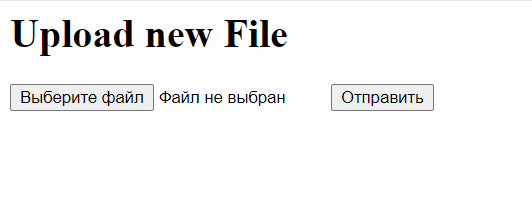
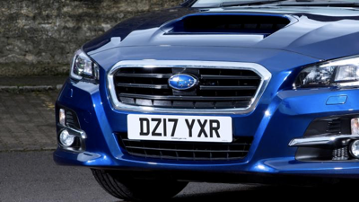
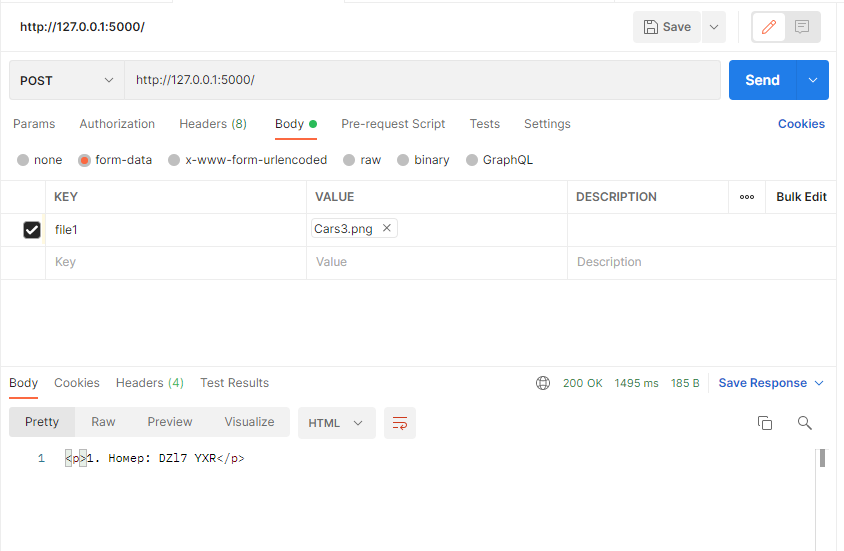

# license-detection-recognition

## Prerequisites
- Python 3
- CPU or NVIDIA GPU + CUDA CuDNN

## Getting Started
### Installation

#### As web-service
- Clone this repo
- Create env `conda create --name licence-detrec`
- Install requirements `pip install -r requirements.txt`

- Download pretrained model via GD [link](https://drive.google.com/file/d/1-EP2Wq4QAytT2oC-qor2-4_kb9wgdtf2/view?usp=sharing) [link](https://drive.google.com/file/d/1mv4AJ3cqe7IpQkFucyWSWeQnLck529nC/view?usp=sharing)
- Rename it to medium.pt and put it into detection/models

- Start server:
  `python app.py`

#### As docker (*не получилось пробросить порт и затестить, но сервер запускался :( )
- Run `docker build -t <name> path/to/app/dir`
- Run `docker run -p your_port:5000`

## USAGE
- Send POST request using form or manually 

## Results

|1st row: Input / 2nd row: Result 
|:---:|
||
||
